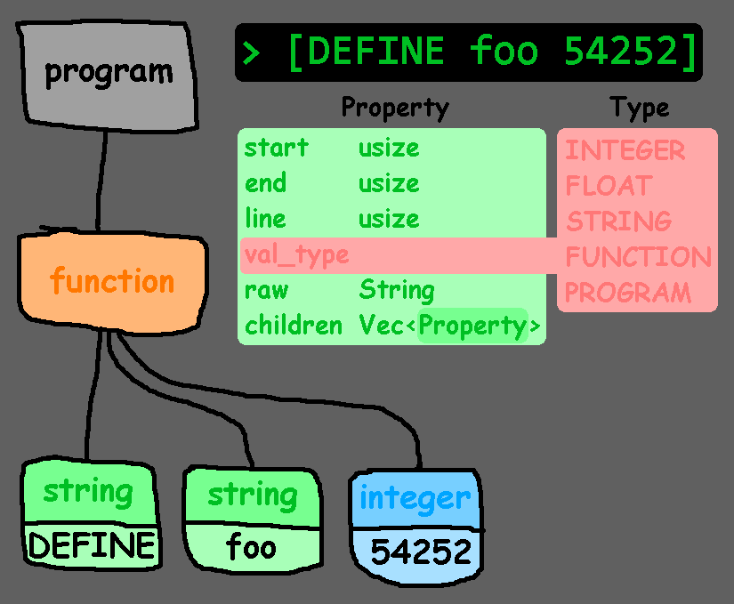

# B* Parser

Output tree as of 0.2.2
## Building Instructions

### Prerequisites
- [PyO3](https://github.com/PyO3/pyo3/)
- [Maturin](https://github.com/PyO3/maturin)

Do `maturin build -r -i (python version)` to obtain python wheels 🛞🛞🛞🛞

## Long-term plans
- Multi-thread

## Benchmarks

soon